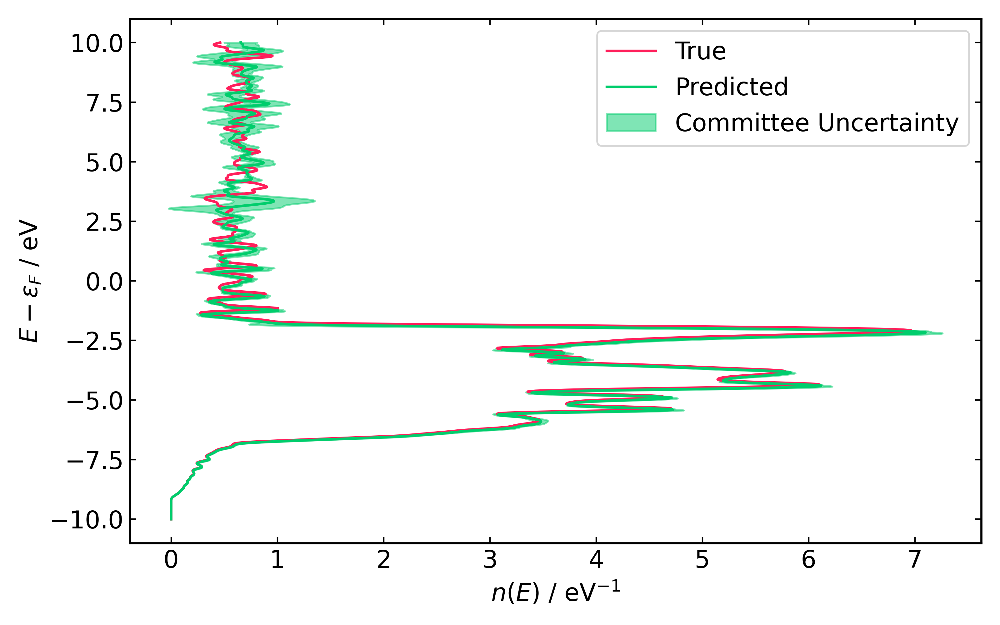

```@contents
Pages = ["tutorial.md"]
Depth = 3
```

# Tutorial

This tutorial outlines how to predict the density of states (DOS) of Au(HCP) together with committee uncertainty. The tutorial should only be run after installing the required Julia and Python packages as outlined in the [Installation](installation.md) instructions.

The tutorial only includes the inference stage because training the models would require significant HPC resources. The trained Hamiltonian and overlap models are provided in the [Models](https://github.com/vitartas/ML_Hamiltonians_Gold/models) directory.

## Matrix Inference

|Estimated Time|
|:------------:|
|~15 mins|

This section outlines how to predict the real-space Hamiltonian and overlap matrices of Au(HCP) using the provided models.

Once `ML_Hamiltonians_Gold` data has been cloned from GitHub, one should be able to find files called `predict_matrices.jl` and `predict_matrices.sh`. Both scripts contain some variables that should be changed:

|Variable name|Description|Location|Needs to be Changed|
|:-----------:|:---------:|:------:|:-----------------:|
|`ACEH_DIR`|Directory path where `ACEhamiltonians` was installed.|`.sh`|**YES**|
|`JULIA_EXEC`|Julia executable name.|`.sh`|**NO**|
|`N_PROCS`|Number of processes used in the calculation.|`.sh`|**NO**|
|`ML_Hamiltonians_Gold_path`|Path to the cloned `ML_Hamiltonians_Gold` repository.|`.jl`|**NO**|
|`committee_size`|Number of processes used in the calculation.|`.jl`|**NO**|

Once the variables have been adjusted accordingly, the inference can be started by running the shell script as follows:

```shell
source predict_matrices.sh
```

!!! warning
    Make sure the appropriate version of Julia is loaded from the SCRTP system before running this script. Julia should be loaded from the module system in the same way as in the [Installation](installation.md).

The script should start running in the background, generating a logger file `nohup.out`, and an HDF5 database file `Au_hcp_committee.h5` which contains the predicted data. The script should take about ~15 minutes to finish (with `N_PROCS=8`).

## Post-Processing

|Estimated Time|
|:------------:|
|~10 mins|

Once the matrix inference has been completed successfully, the predicted matrices can be used to obtain the electronic Density of States (DOS) for Au(HCP) with a committee uncertainty. The cloned repository should contain a Python file `postprocess_data.py`, which also has a `ML_Hamiltonians_Gold_path` variable as in the matrix inference stage, and it might have to be adjusted accordingly. The script can be run as follows:

```shell
python postprocess_data.py
```

!!! warning
    Make sure the `hamutils` package is available in your Python environment. Before running the script above, one should activate the Python environment with `hamutils` as in the [Installation](installation.md).

The script should take about 10 minutes to finish, after which a file called `Au_hcp_DOS.pdf` should be visible in the cloned repository. The expected result is shown in the figure below.

